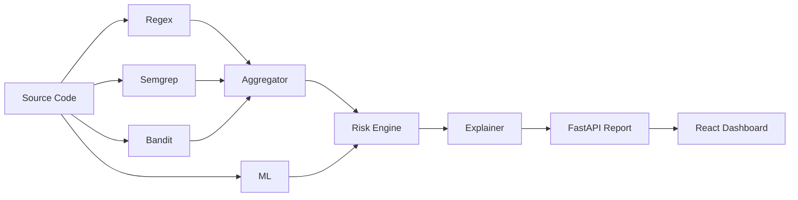

# Architecture

## Overview

Hybrid AppSec pipeline: deterministic scanners produce categorized findings; ML provides binary risk probability only; risk engine and explainer produce the final report.

## Components

| Layer | Module | Responsibility |
|-------|--------|----------------|
| API | `backend/app/api/routes.py` | HTTP endpoints |
| Orchestrator | `backend/app/services/analyzer.py` | Pipeline coordination |
| Regex | `backend/app/security/regex_detector.py` | Pattern-based detection |
| Semgrep | `backend/app/security/semgrep_runner.py` | External rule engine |
| Bandit | `backend/app/security/bandit_runner.py` | Python linter |
| ML | `backend/app/ml/mock_model.py` | Temporary risk scoring |
| ML (future) | `backend/app/ml/codebert_model.py` | Trained CodeBERT plug-in |
| Risk | `backend/app/security/risk_engine.py` | Score 0–100, severity |
| Explainer | `backend/app/security/explainer.py` | Remediation content |
| Reports | `backend/app/services/report_store.py` | Persist JSON reports |

## ML plug-in contract

Implement `BaseMLModel`:

- `load()` — load weights
- `predict(code, language)` → `MLPrediction(risk_probability, suspicious_score, is_suspicious)`

Set `ML_PROVIDER=codebert` in `.env`. No API or frontend changes required.

## Data flow

